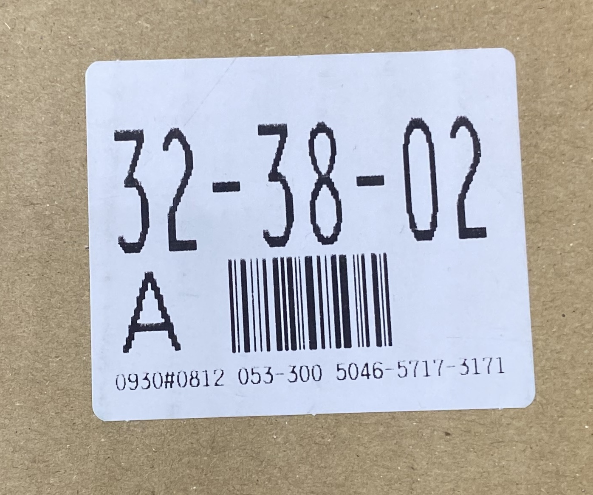
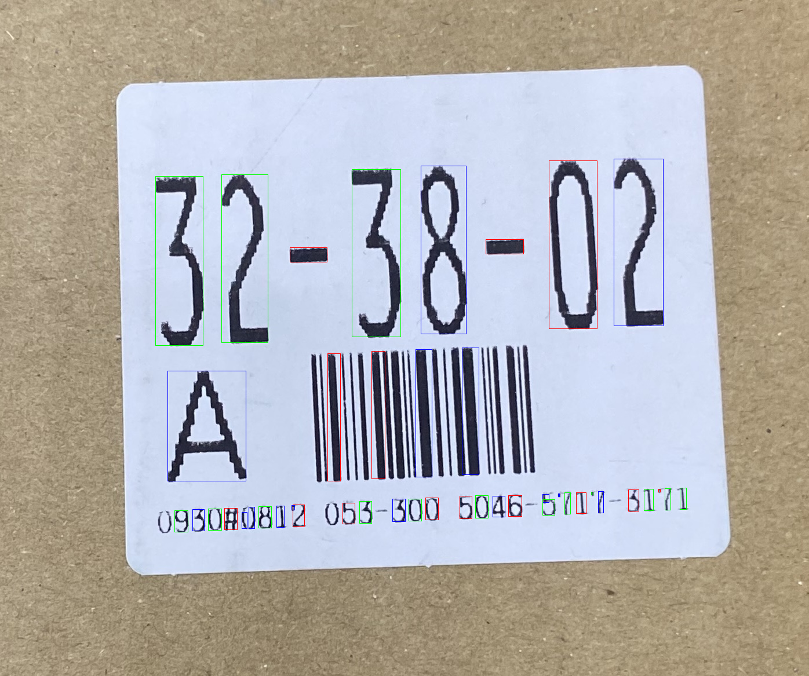
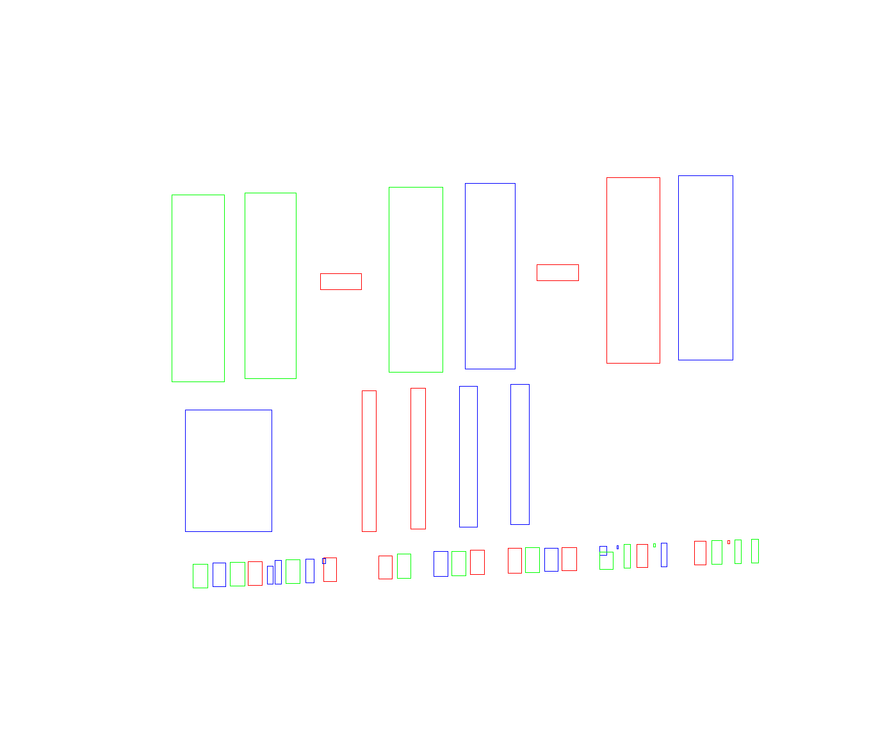
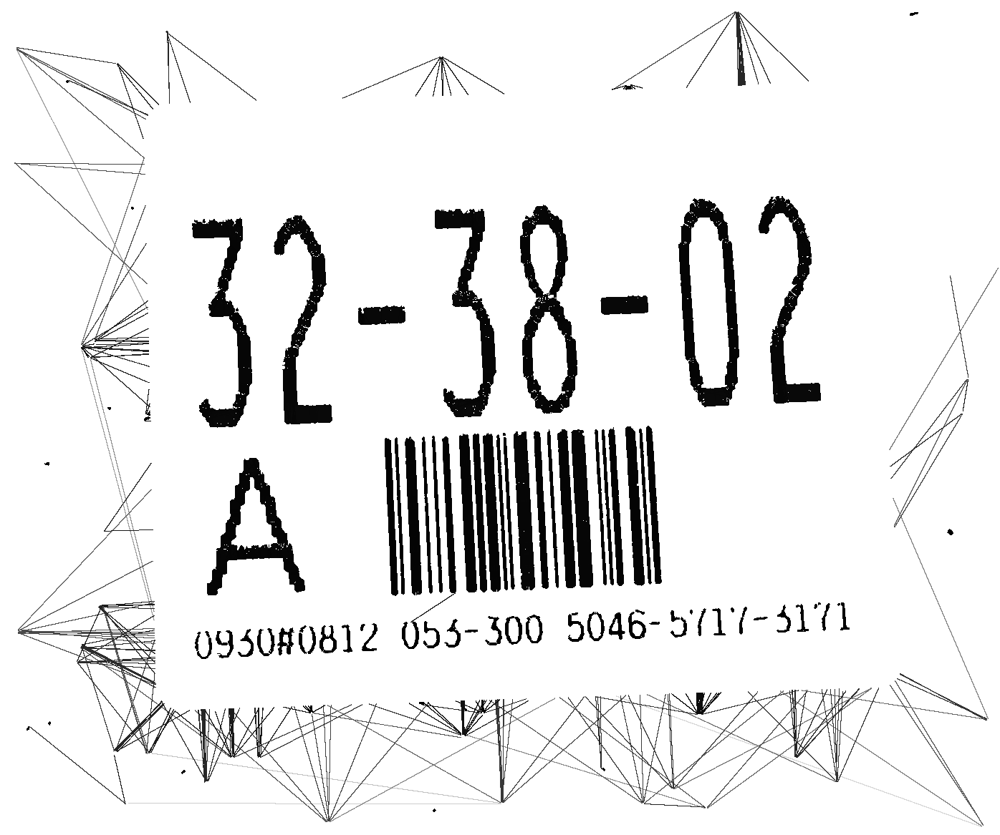
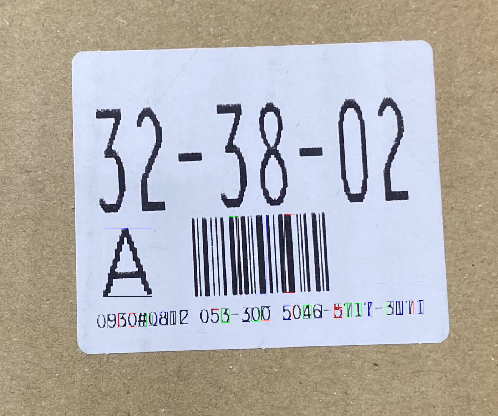
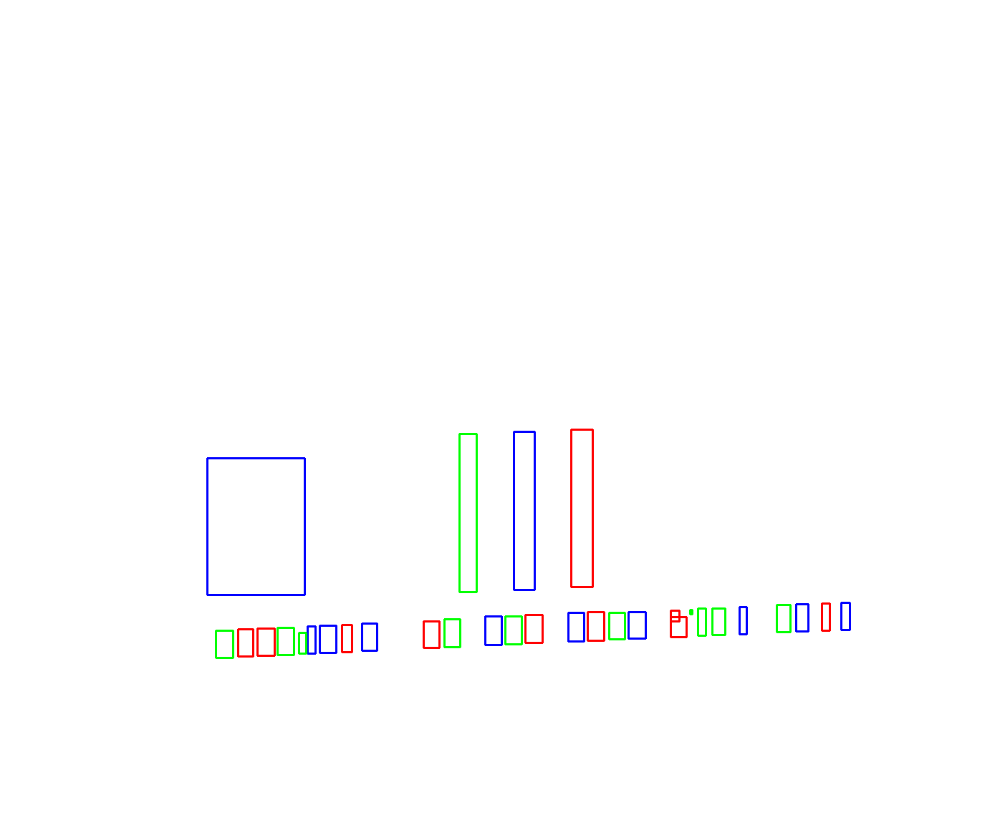
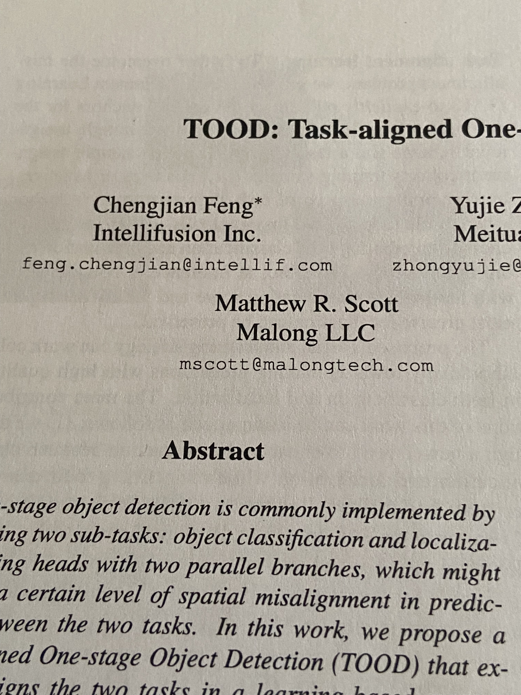

# text-region-rs

Rust implementation of text-region detection algorithms.

現在は MSER と SWT (Stroke Width Transform) を実装しています。SWT は OpenCV の `text::detectTextSWT` の挙動を参照し、Rust 側のユニットテストとサンプル画像で数値・検出結果を比較しながら移植しています。

## Features

- MSER v1 / v2 detector
- SWT detector
- `image` crate の `GrayImage`, `RgbImage`, `ImageBuffer<Luma<f32>, Vec<f32>>` を使う API
- SWT の debug 出力
  - SWT 正規化画像
  - 文字 bbox
  - chain bbox
  - 元画像への overlay
- Criterion benchmark

## Result Examples

### SWT

`resource/IMG_8364.jpeg` に SWT を適用した例です。現在の default parameter では、上段の大きい `32-38-02` も検出対象に入ります。

<p>
  
  
  
</p>

左から、入力画像、元画像への Rust SWT bbox overlay、白背景の Rust SWT debug bbox です。

<p>
  
  
  
</p>

左から、正規化した SWT 画像、OpenCV SWT overlay、OpenCV SWT debug bbox です。

Current Rust SWT sample output:

- input: `1396x1167`
- letter boxes: `44`
- chain boxes: `25`

### MSER

MSER は bounding box と region pixels の可視化を出せます。

<p>
  
  
  
</p>

左から、入力画像、MSER bounding boxes、MSER region pixels です。

## Usage

### SWT

```rust
use image::ImageReader;
use text_region_rs::swt::{detect_text_swt_with_debug, SwtParams};

fn main() -> text_region_rs::error::Result<()> {
    let image = ImageReader::open("resource/IMG_8364.jpeg")?
        .decode()?
        .to_rgb8();

    let output = detect_text_swt_with_debug(&image, SwtParams::default())?;

    println!(
        "letters={}, chains={}",
        output.detections.letter_bounding_boxes.len(),
        output.detections.chain_bounding_boxes.len()
    );

    output.normalized_swt.save("swt_normalized.png")?;
    output.draw_rgb.save("swt_debug.png")?;
    Ok(())
}
```

Lower-level SWT stages are also public:

```rust
use text_region_rs::swt::{
    stroke_width_transform, swt_connected_components, swt_preprocess_rgb,
    SwtParams,
};

# fn run(image: &image::RgbImage) -> text_region_rs::error::Result<()> {
let preprocessed = swt_preprocess_rgb(image)?;
let swt = stroke_width_transform(
    &preprocessed.edge,
    &preprocessed.gradient_x,
    &preprocessed.gradient_y,
    SwtParams::default(),
)?;
let components = swt_connected_components(&swt)?;
# Ok(())
# }
```

### MSER

```rust
use image::ImageReader;
use text_region_rs::mser::{extract_msers_v2, MserParams};

fn main() -> text_region_rs::error::Result<()> {
    let gray = ImageReader::open("resource/IMG_8237.jpeg")?
        .decode()?
        .to_luma8();

    let regions = extract_msers_v2(&gray, &MserParams::default())?;
    println!(
        "from_min={}, from_max={}",
        regions.from_min.len(),
        regions.from_max.len()
    );

    Ok(())
}
```

## Examples

Run SWT on a sample image and write debug artifacts next to the input image:

```sh
cargo run --example swt_detect -- resource/IMG_8364.jpeg
```

Outputs:

- `resource/IMG_8364_swt_debug.png`
- `resource/IMG_8364_swt_overlay.png`
- `resource/IMG_8364_swt_normalized.png`
- `resource/IMG_8364_swt_letters.tsv`
- `resource/IMG_8364_swt_chains.tsv`

Run MSER visualization:

```sh
cargo run --example maser_detect -- resource/IMG_8237.jpeg --v2 --8conn
```

Outputs:

- `resource/IMG_8237_mser_bbox.png`
- `resource/IMG_8237_mser_pixels.png`

## Tests

```sh
cargo test
```

The SWT tests cover:

- input validation
- first and second pass SWT values
- connected components
- component filtering
- chain heuristics
- full RGB pipeline

## Benchmarks

```sh
cargo bench --bench mser_bench
cargo bench --bench swt_bench
```

`swt_bench` measures:

- RGB preprocessing
- stroke width transform
- connected components
- component filtering
- full SWT detection
- full SWT detection with debug output
- full SWT detection by image size

## Project Layout

```text
src/
  mser/        MSER implementation
  swt/         SWT implementation
benches/       Criterion benchmarks
examples/      Runnable examples
resource/      Sample images and generated result images
tests/         Integration tests
```
